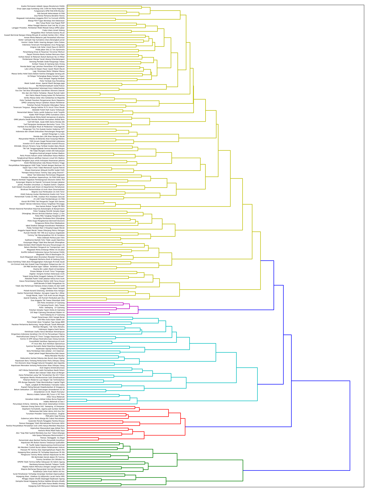

# Learning Clustering (BahasaIndonesia)

## Code

source: http://brandonrose.org/clustering
modified by : kirra

## Data sources

1. [Kompas online collection](http://ilps.science.uva.nl/ilps/wp-content/uploads/sites/6/files/bahasaindonesia/kompas.zip).
   This corpus contains [Kompas online](http://www.kompas.com/) news articles from 2001-2002. See
   [here](http://ilps.science.uva.nl/resources/bahasa/) for more info and citations.
1. [Tempo online collection](http://ilps.science.uva.nl/ilps/wp-content/uploads/sites/6/files/bahasaindonesia/tempo.zip).
   This corpus contains [Tempo online](https://www.tempo.co/) news articles from 2000-2002. See
   [here](http://ilps.science.uva.nl/resources/bahasa/) for more info and citations.
   
   
## Step

1. tokenizing and stemming each article (Bahasa Indonesia)
1. transforming the corpus into vector space using tf-idf
1. calculating cosine distance between each document as a measure of similarity
1. clustering the documents using the k-means algorithm
1. using multidimensional scaling to reduce dimensionality within the corpus
1. plotting the clustering output using matplotlib and mpld3
1. conducting a hierarchical clustering on the corpus using Ward clustering
1. plotting a Ward dendrogram
1. topic modeling using Latent Dirichlet Allocation (LDA)

## How to use 

1. download the new (kompas and tempo) extract to folder "data"
1. create virtualenvironment python >>> $ virtualenv env
3. activate virtualenvironment >>> source env/bin/activate
4. install all depedencies >>> pip install -r requirements.txt
5. run jupiter >>> jupyter notebook
6. open file "Clustering.ipynb"

## Example visualization

### Source for vosualization
1. http://adilmoujahid.com/posts/2015/01/interactive-data-visualization-d3-dc-python-mongodb/
1. http://bl.ocks.org/lmatteis/efd9be8f472e673eef6ce9d1951256a9
1. https://bl.ocks.org/bricedev/8b2da06ddef27d94cde9
1. https://bl.ocks.org/jyucsiro/767539a876836e920e38bc80d2031ba7
1. https://bl.ocks.org/emeeks/df6ea0128724289337ef
